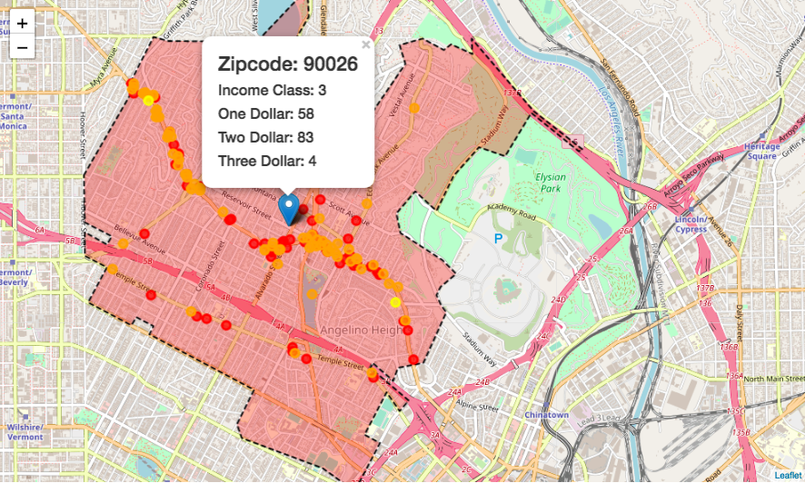

# Executive Summary
-----------------------------------

*Submitted by [Daniel Stern](https://github.com/dstern1215), [Rex Chang](https://github.com/rexchang0424), [Julian Sweet](https://github.com/jsweet080) and [Jane Liang](https://github.com/jlian014)*

## Problem Statement

In this Data Science project, we want to test a broad idea that if we can use big data related to commercial activity as an indicator for neighborhood affluency. We're going to develop a tool to estimate the affluence of a neighborhood based on the number of of businesses and services according to Yelp dollar signs (\\$,\\$\\$,\\$\\$\\$,\\$\\$\\$) in a given neighborhood. This tool will use a list of zip codes to estimate the wealth of the locality. While traditional methods typically estimate wealth of a locality based on demographic characteristics (e.g. income or unemployment rate), the novelty of this approach is in its use of big data related to commercial activity and cost of product and services as an indicator for affluency.


## Data Description

The Yelp dataset is a subset of Yelp businesses, reviews, and user data for use in personal, educational, and academic purposes. Available as JSON files (2.66 GB).

```
[yelp_academic_dataset](https://www.yelp.cz/dataset)
  ├───yelp_academic_dataset_business.json (174,000 business attributes)
  ├───yelp_academic_dataset_review.json (5,200,000 reviews)
  ├───yelp_academic_dataset_user.json (366k rows)
  ├───yelp_academic_dataset_checkin.json (45k rows)
  └───yelp_academic_dataset_tip.json (495k rows)
  └───yelp_academic_dataset_photo.json (495k rows)
      
```
We only used Business JSON fiel to conduct an analysis. An example of the Business JSON file, it locates:

business_id | attributes | categories	| city | full_address | hours | latitude | longitude | name | neighborhoods | open | review_count | stars | state | type
:---: | :---: | :---: | :---: | :---: | :---: | :---: | :---: | :---: | :---: | :---: | :---: | :---: | :---: | :---: |


In this nested dictionary format like JSON file, "$" can be found in the
keyword `attributes` and `RestaurantsPriceRange2`.

<br>
<br>

RestaurantsPriceRange2 | BikeParking | BusinessAcceptsCreditCards	| GoodForKids| RestaurantsAttire | NoiseLevel | OutdoorSeating | RestaurantsAttire | RestaurantsDelivery | RestaurantsTakeOut | RestaurantsReservations | GoodForKids | HasTV | 
:---: | :---: | :---: | :---: | :---: | :---: | :---: | :---: | :---: | :---: | :---: | :---: | :---: |


The [IRS 2016 Individual Income Tax Statistics](https://www.irs.gov/statistics/soi-tax-stats-individual-income-tax-statistics-2016-zip-code-data-soi) is our variables to identify the zipcode affluent. The data shows that population that was filed and processed by the IRS during the 2016 calendar year. The money amounts are reported are divided in 6 numerical categories.

                1 = $1 under $25,000
                2 = $25,000 under $50,000
                3 = $50,000 under $75,000
                4 = $75,000 under $100,000
                5 = $100,000 under $200,000
                6 = $200,000 or more

We selected the median income categories for each zip code(neighborhood) as our target variable. 

**The data dictionary of the resulted dataframe:**

|Variables| dtype| description |
|-------|----|-----|
|zip|int64|zipcode|
|yelp_dollar_1|int|the number of businesses that have 1 dollar signs in this zipcode area|
|yelp_dollar_2|int|the number of businesses that have 2 dollar signs in this zipcode area|
|yelp_dollar_3|int|the number of businesses that have 3 dollar signs in this zipcode area|
|yelp_dollar_4|int|the number of businesses that have 4 dollar signs in this zipcode area|
|Total_Business|int|the total number of businesses in this zipcode area|
|STATE|object|States|
|income_level_1|float|the number of people whose income level lie in level_1 category(statistics from IRS)|
|income_level_2|float|the number of people whose income level lie in level_2 category(statistics from IRS)|
|income_level_3|float|the number of people whose income level lie in level_3 category(statistics from IRS)|
|income_level_4|float|the number of people whose income level lie in level_4 category(statistics from IRS)|
|income_level_5|float|the number of people whose income level lie in level_5 category(statistics from IRS)|
|income_level_6|float|the number of people whose income level lie in level_6 category(statistics from IRS)|
|target|int|the target variable shows the neighborhood affluence

# Jupyter notebook contents

1. [Data Gathering and Cleaning](/Code/01_Data_Gathering_and_Cleaning.ipynb)

    1.1 [Data Preprocessing](/Code/01_Data_Gathering_and_Cleaning.ipynb)
    
    1.2 [Merge with IRS Dataset](/Code/01_Data_Gathering_and_Cleaning.ipynb)
    
    1.3 [Target Variable](/Code/01_Data_Gathering_and_Cleaning.ipynb)
    
    
    
2. [EDA and Mapping](/Code/02_EDA_and_Mapping.ipynb)
    
    2.1 [Imcome Class Distribution](/Code/02_EDA_and_Mapping.ipynb)
    
    2.2 [Yelp Dollar Signs by Metro Areas](/Code/02_EDA_and_Mapping.ipynb)
    
    2.3 [Plotting Maps](/Code/02_EDA_and_Mapping.ipynb)
    
    2.4 [Correlation Heatmaps](/Code/02_EDA_and_Mapping.ipynb)
    
  
3. [Feature Engineering and Modeling](/Code/03_Feature_Engineering_&_Modeling.ipynb)

    3.1 [Scaling Yelp Dollar Signs](/Code/03_Feature_Engineering_&_Modeling.ipynb)
    
    3.2 [Engineered Feature: Distance to the Downtown](/Code/03_Feature_Engineering_&_Modeling.ipynb)
    
    3.3 [Modeling](/Code/03_Feature_Engineering_&_Modeling.ipynb)


4. [Final Product](/Code/04_Final_Product.ipynb)
    
    
# Figures and Findings


# Conclusions and Future Works

We have trained the Random Forest Classifier, Logistic Regression, and K-Nearest Neighbor Classifier to predict neighborhood affluence. The best performed model is Logistic Regression with 64.49% accuracy which is not much different than the baseline score (63.19%). The model's failure is due to:

1) Limited Scope: In the Yelp Open Dataset, most business informations are
located in the states of Arizona and Nevada. In order for our model to perform signficantly better than the baseline model, we would need an equivalent size of information in other areas. It's currently not representative of the overall U.S. population.

2) Limited features: We only take into account the aggregate expenditure level and distance from downtown for any given zip code. This is not sufficient when building our model. Having additional features like business's category and ambiance may improve the model performance.

3) Other Machine Learning Algorithms: We choose interpretable models instead of black box models in order to investigate the relationships between affluence of a neighborhood and the number of businesses according to Yelp dollar signs (\\$,\\$\\$,\\$\\$\\$,\\$\\$\\$) in a given neighborhood. It is worth to try different Machine learning models like XGBoost, Support Vector Machine and Neural Networks. However, with the features that possess the weak signal to the target variable, we expect it may hard to further improve the model's performance.

Therefore, the final product we are delivering here is:
Use Zip Code to show the locate the area in the map and show the businesses with Yelp dollar sign informations in the given Zip Code.  



